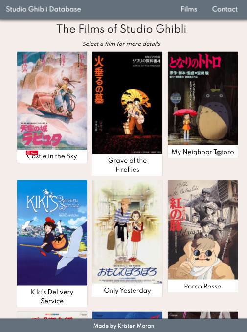
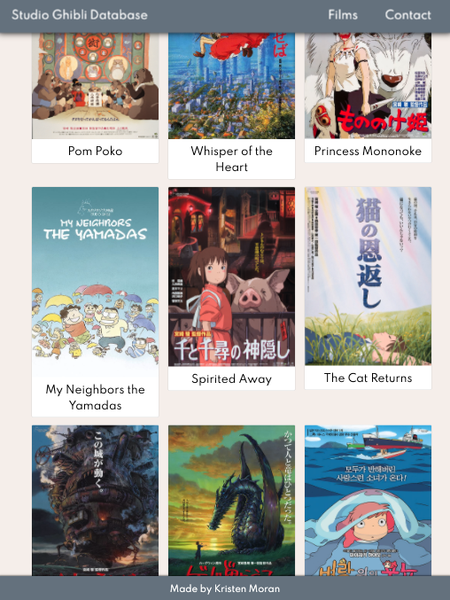
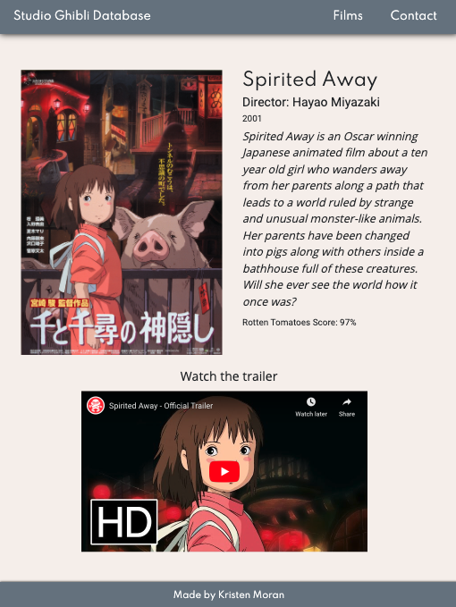

# Studio Ghibli Database

## Project Description

My second project for General Assembly's Software Engineering Immersive was to build a front-end application using the React framework and utilizing an API. I chose to build a movie database for one of my favorite animation studios, Studio Ghibli.

The API I used was the [Studio Ghibli API](https://ghibliapi.herokuapp.com/#).

The problem this project solves is that not many people have seen Studio Ghibli films. This database offers a place for people to learn more about the films and drive interest in watching the films. This database serves as an introduction to films of Studio Ghibli!

## From the Database

### Homepage


### Film List Page



### Film List Page Cont'd



### Individual Movie Page



## Features/User Stories

## User Stories

- _As a user, I want to see a listing of all the movies Studio Ghibli has made._
- _As a user, I want to click on a specific movie and read a description of the movie and further details like, director, Rotten Tomato score, and release date._
- _As a user, I want to easily navigate the movies on my mobile device so I can view movie details._
- _As a user, I would like to view the trailer of the movie._

_**Post Stretch Goal**_

- _As a user, I would like to be able to search for movies by name so I can easily find a movie and view its details._
- _As a user, I would like to be recommended a movie to watch._

## Issues/Hurdles

The the Studio Ghibli API is a great resource for information about the Studio's films, however, images and links to the trailers were not included in the API. I had to find all the film posters and trailer links.

The tricky part was going to match up the correct poster with the movie title. I decided to locally host the film posters and not pull in a link that may remove the image later. Luckily, the Studio Ghibli API has unique Ids for each movie so I made a separate file and matched up the Id with the poster image's path. The issue I came across was that with React, images have to be imported (ie 'import castleinthesky from 'imgs/posters/castleinsky.png') in order for the image ot display properly. So in my file, I imported the posters path and then listed it in the object with the corresponding Id.

Then in order to link up the correct image with it's movie information, I utilized the find() method, passed down the props, and matched the movie poster with the API Id.

I created a separate file for the YouTube links as well and used React Player to display the trailers.

## Technologies and Frameworks Used

- HTML5, CSS, JavaScript, React, React Hooks, React Router, React Player, Bootstrap

## Installation

```
Install Studio Ghibli Data:
1. Fork & clone the repository
2. Add/enhance features and technologies!
3. Submit any issues
```

## Contribute

[Source Code](https://github.com/kristenmoran/project-2)
[Issue Tracker](https://github.com/kristenmoran/project-2/issues)
